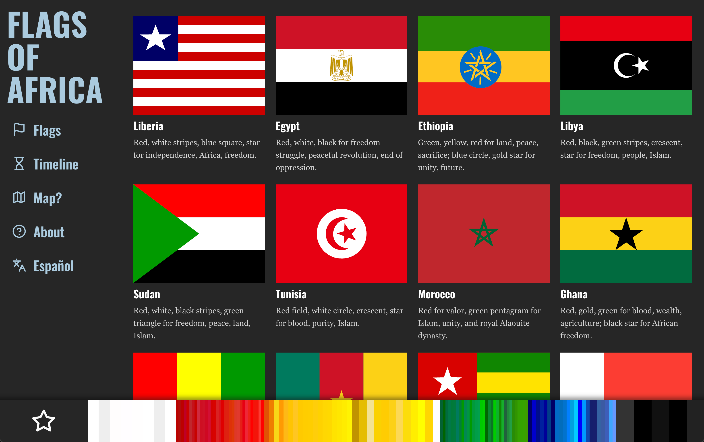
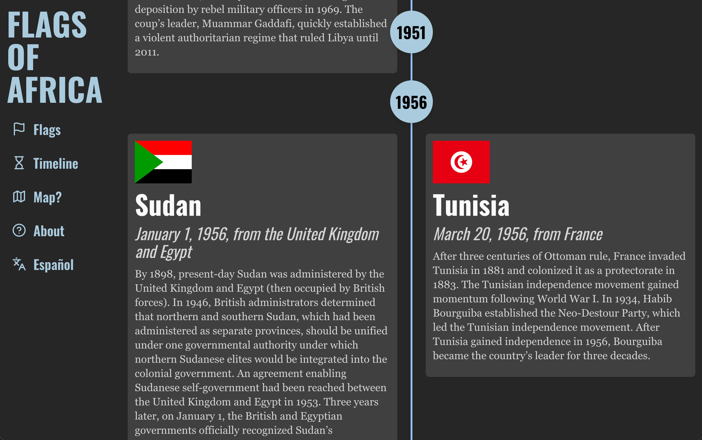
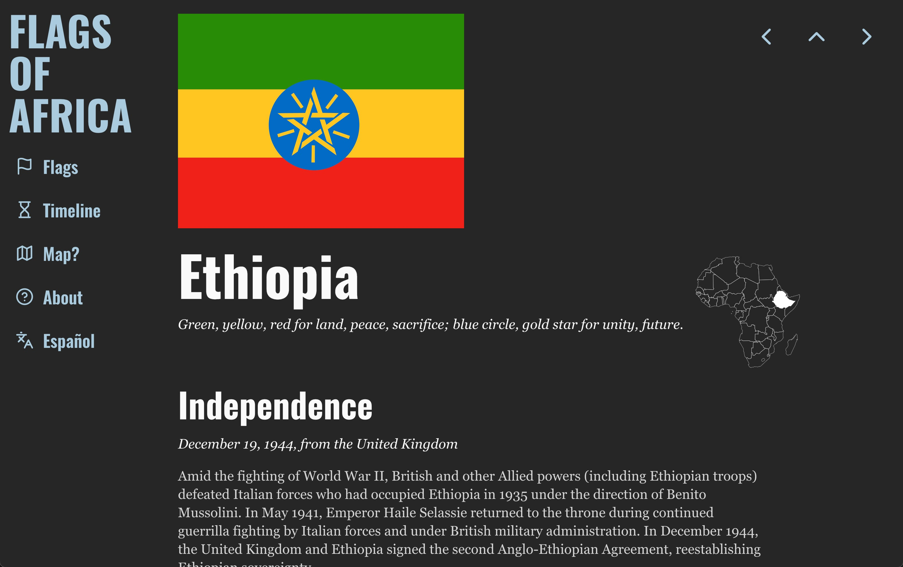

# bkm-flags-of-africa

Prototype resource for information about the flags of Africa and independence.

## Next.js template

Based on https://github.com/shadcn/next-template ([Website](https://template.shadcn.com/), [UI Components](https://ui.shadcn.com/)).

## Features

- Flag-based navigation
- Filter by color or symbol
- Independence timeline
- Internationalization (English, Spanish)
- Dynamic Africa countries map

## Installation & Running

Fork/download this project and run `npm i` to install dependencies.

Then, run the development server with `npm run dev` and open http://localhost:3000 with your browser to see the result.

If you have not yet loaded the Elasticsearch data, you should see an error on the search page that the index does not exist.

## License

Licensed under the [MIT license](./LICENSE.md).

## Screenshots

